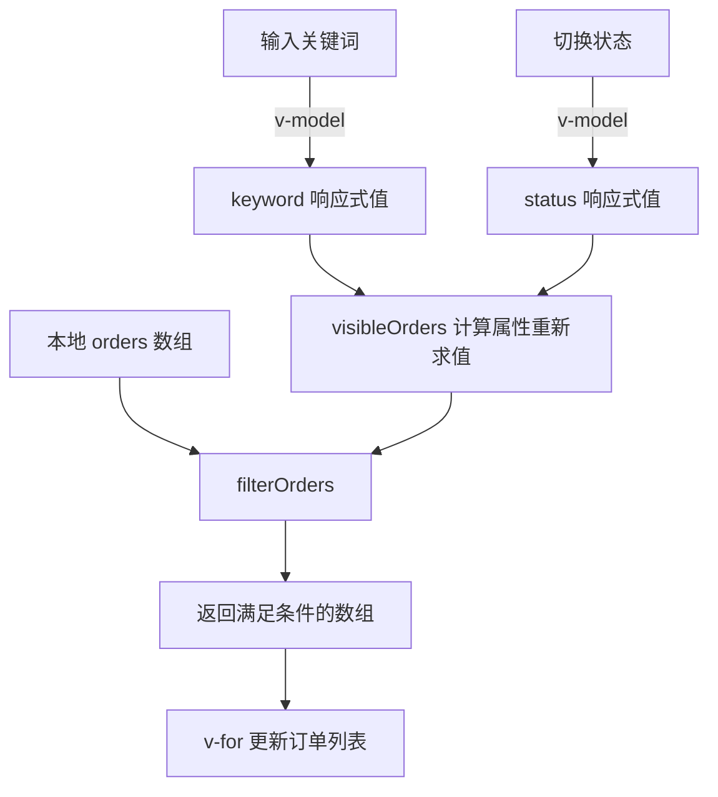

我会先读取你指定的技能，再沿着订单列表的输入、状态切换和数据请求代码梳理调用关系。全程只读，不联网、不安装依赖，也不启动子代理。

已按 `frontend-workflow-bootstrap` 技能的“局部理解”模式检查源码：订单列表直接筛选本地数组，这条链路没有发起接口请求。我会再确认页面入口，并说明关键词和状态如何组合生效。

**订单筛选在前端完成，数据来自本地数组；输入关键词或切换状态都不会发起接口请求。**

已按指定技能的“局部理解”模式检查入口、订单页面、筛选函数、数据和相关测试。

页面入口是 [main.mjs]([repository]/outputs/skill-benefit-evaluation/workspaces/understanding-after/src/main.mjs:1)，它挂载 `App`；[App.vue]([repository]/outputs/skill-benefit-evaluation/workspaces/understanding-after/src/App.vue:1) 直接渲染 `OrderList`。页面内部的调用关系如下：

在 [OrderList.vue]([repository]/outputs/skill-benefit-evaluation/workspaces/understanding-after/src/pages/OrderList.vue:5) 中：

- 初始值是 `keyword = ""`、`status = "all"`，因此默认显示全部订单。
- 输入框通过 `v-model` 更新关键词，下拉框通过 `v-model` 更新状态。
- `visibleOrders` 使用 `computed`，依赖这两个值。任意一个变化，都会按当前两个条件调用 `filterOrders(orders, { keyword, status })`。
- 模板遍历筛选结果，显示订单编号和客户名。没有搜索按钮、显式防抖或异步请求；切换状态也不会清空关键词。

[filterOrders]([repository]/outputs/skill-benefit-evaluation/workspaces/understanding-after/src/order-filter.mjs:2) 的规则是：

| 条件 | 实际行为 |
|---|---|
| 关键词 | 去掉首尾空白、转小写，再对“订单编号 + 空格 + 客户名”做子串匹配 |
| 空关键词或纯空白 | 不限制关键词 |
| 状态为 `all` | 不限制状态 |
| 状态为 `paid` / `pending` | 精确匹配订单状态 |
| 两个条件组合 | **同时满足**才保留 |

函数使用 `Array.filter` 返回新数组，不修改原始订单。

[本地数据]([repository]/outputs/skill-benefit-evaluation/workspaces/understanding-after/src/data/orders.mjs:1) 只有两条：`AB-001 / Alice / paid` 和 `CD-002 / 张三 / pending`。因此，按源码推导：输入 ` alice ` 会显示 `AB-001`；保持关键词并切换到“待支付”，列表就会为空；再清空关键词，就会显示 `CD-002`。

以上是静态源码结论，未启动页面或运行测试。现有测试只覆盖“空关键词保留全部订单”，尚不能证明组合筛选和页面交互已通过验证。全程未联网、安装依赖、修改文件或启动子代理。