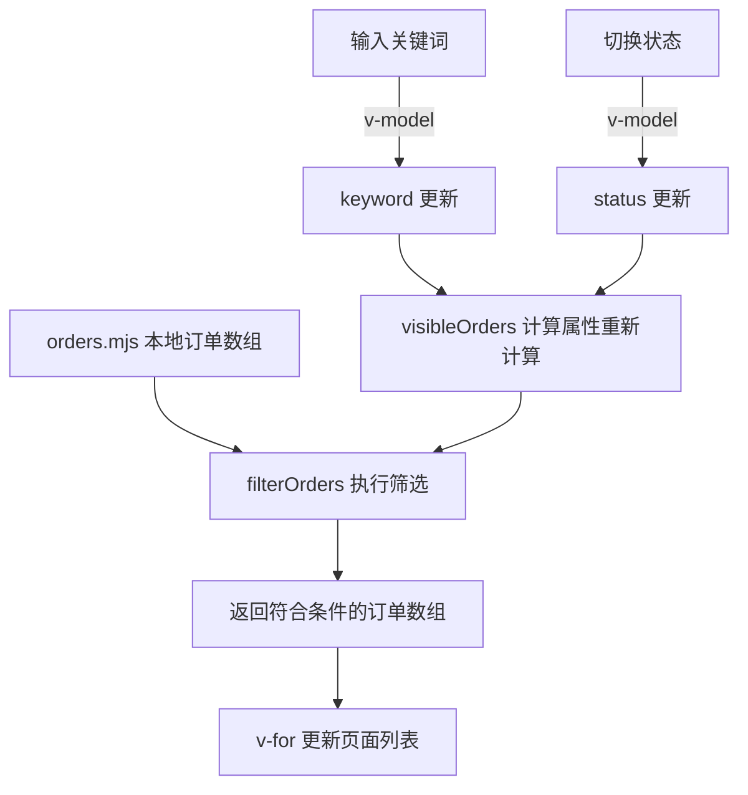

我会先阅读你指定的技能，再沿着订单列表的关键词输入、状态切换和数据请求追踪源码，全程只读，不联网或启动子代理。

订单列表使用的是**前端本地筛选**：输入关键词、切换状态后，Vue 重新计算要显示的订单，再更新列表。这条调用链没有请求后端接口。

页面入口是 [main.mjs]([repository]/outputs/understanding-pair-20260909/workspaces/understanding-after/src/main.mjs:1) 挂载 `App`，由 [App.vue]([repository]/outputs/understanding-pair-20260909/workspaces/understanding-after/src/App.vue:2) 直接渲染 `OrderList`。

[OrderList.vue]([repository]/outputs/understanding-pair-20260909/workspaces/understanding-after/src/pages/OrderList.vue:1) 把页面交互和筛选连接起来：

- `keyword` 初始为 `""`，`status` 初始为 `"all"`，所以首次展示全部订单。
- 输入框通过 `v-model="keyword"` 更新关键词；下拉框通过 `v-model="status"` 更新状态，取值是 `all`、`paid`、`pending`。
- `visibleOrders` 是 `computed`，读取这两个响应式值，并调用 `filterOrders(orders, { keyword, status })`。任意一个变化，都会触发重新计算；没有提交按钮或防抖逻辑。
- 模板用 `v-for="order in visibleOrders"` 展示筛选结果，每项显示订单编号和客户名。

具体规则在 [order-filter.mjs]([repository]/outputs/understanding-pair-20260909/workspaces/understanding-after/src/order-filter.mjs:2)：

| 条件 | 实际行为 |
|---|---|
| 关键词 | 去掉首尾空格、转成小写，在“订单编号 + 空格 + 客户名”中做包含匹配 |
| 空关键词或纯空格 | 不限制关键词 |
| 状态为 `all` | 不限制状态 |
| 其他状态 | 要求 `order.status` 与所选状态完全一致 |
| 两个条件同时存在 | **必须同时满足**关键词和状态条件 |

数据来自静态导入的 [orders.mjs]([repository]/outputs/understanding-pair-20260909/workspaces/understanding-after/src/data/orders.mjs:1)，目前只有两条订单。例如：

1. 输入 `ALI`、状态选“全部”：显示 `AB-001 Alice`。
2. 保留 `ALI`、切换为“待支付”：结果为空，因为 Alice 的订单是已支付。
3. 清空关键词、保持“待支付”：显示 `CD-002 张三`。

每次筛选都使用原始 `orders` 数组，返回新的结果数组，不会删改原始订单。

以上基于源码静态阅读，未运行应用或测试，未修改任何文件。